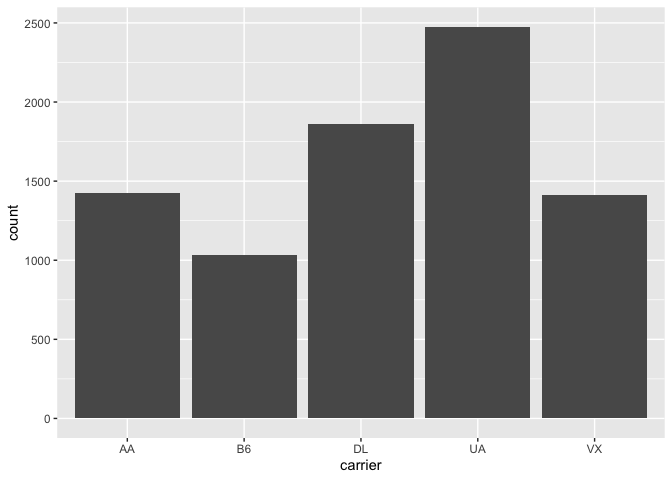

## Install Packages

```r
options(repos = c(CRAN = "http://cran.rstudio.com"))
install.packages("tidyverse")
```

```
## also installing the dependencies 'cli', 'purrr'
```

```
## 
## The downloaded binary packages are in
## 	/var/folders/6f/tlvpl2nd74jgyyxb3sj20fr00000gn/T//RtmpsI2pQU/downloaded_packages
```

```r
install.packages("nycflights13")
```

```
## 
## The downloaded binary packages are in
## 	/var/folders/6f/tlvpl2nd74jgyyxb3sj20fr00000gn/T//RtmpsI2pQU/downloaded_packages
```

## Working directory

```r
getwd()
```

```
## [1] "/Users/achichi/Desktop/BIS15W2023_gochieng clone"
```

## Session Info

```r
sessionInfo()
```

```
## R version 4.2.2 (2022-10-31)
## Platform: x86_64-apple-darwin17.0 (64-bit)
## Running under: macOS Big Sur ... 10.16
## 
## Matrix products: default
## BLAS:   /Library/Frameworks/R.framework/Versions/4.2/Resources/lib/libRblas.0.dylib
## LAPACK: /Library/Frameworks/R.framework/Versions/4.2/Resources/lib/libRlapack.dylib
## 
## locale:
## [1] en_US.UTF-8/en_US.UTF-8/en_US.UTF-8/C/en_US.UTF-8/en_US.UTF-8
## 
## attached base packages:
## [1] stats     graphics  grDevices utils     datasets  methods   base     
## 
## loaded via a namespace (and not attached):
##  [1] digest_0.6.31   R6_2.5.1        lifecycle_1.0.3 jsonlite_1.8.4 
##  [5] magrittr_2.0.3  evaluate_0.19   stringi_1.7.8   rlang_1.0.6    
##  [9] cachem_1.0.6    jquerylib_0.1.4 bslib_0.4.2     vctrs_0.5.1    
## [13] rmarkdown_2.19  tools_4.2.2     stringr_1.5.0   glue_1.6.2     
## [17] xfun_0.36       yaml_2.3.6      fastmap_1.1.0   compiler_4.2.2 
## [21] htmltools_0.5.4 knitr_1.41      sass_0.4.4
```

## Load the libraries

```r
library(nycflights13)
library(tidyverse)
```

```
## ── Attaching packages ─────────────────────────────────────── tidyverse 1.3.2 ──
## ✔ ggplot2 3.4.0      ✔ purrr   1.0.1 
## ✔ tibble  3.1.8      ✔ dplyr   1.0.10
## ✔ tidyr   1.2.1      ✔ stringr 1.5.0 
## ✔ readr   2.1.3      ✔ forcats 0.5.2 
## ── Conflicts ────────────────────────────────────────── tidyverse_conflicts() ──
## ✖ dplyr::filter() masks stats::filter()
## ✖ dplyr::lag()    masks stats::lag()
```

## nycflights13

```r
flights
```

```
## # A tibble: 336,776 × 19
##     year month   day dep_time sched_de…¹ dep_d…² arr_t…³ sched…⁴ arr_d…⁵ carrier
##    <int> <int> <int>    <int>      <int>   <dbl>   <int>   <int>   <dbl> <chr>  
##  1  2013     1     1      517        515       2     830     819      11 UA     
##  2  2013     1     1      533        529       4     850     830      20 UA     
##  3  2013     1     1      542        540       2     923     850      33 AA     
##  4  2013     1     1      544        545      -1    1004    1022     -18 B6     
##  5  2013     1     1      554        600      -6     812     837     -25 DL     
##  6  2013     1     1      554        558      -4     740     728      12 UA     
##  7  2013     1     1      555        600      -5     913     854      19 B6     
##  8  2013     1     1      557        600      -3     709     723     -14 EV     
##  9  2013     1     1      557        600      -3     838     846      -8 B6     
## 10  2013     1     1      558        600      -2     753     745       8 AA     
## # … with 336,766 more rows, 9 more variables: flight <int>, tailnum <chr>,
## #   origin <chr>, dest <chr>, air_time <dbl>, distance <dbl>, hour <dbl>,
## #   minute <dbl>, time_hour <dttm>, and abbreviated variable names
## #   ¹​sched_dep_time, ²​dep_delay, ³​arr_time, ⁴​sched_arr_time, ⁵​arr_delay
```

## Filter
Flights between JFK and SFO airports.

```r
flights %>% 
  filter(origin=="JFK" & dest=="SFO")
```

```
## # A tibble: 8,204 × 19
##     year month   day dep_time sched_de…¹ dep_d…² arr_t…³ sched…⁴ arr_d…⁵ carrier
##    <int> <int> <int>    <int>      <int>   <dbl>   <int>   <int>   <dbl> <chr>  
##  1  2013     1     1      611        600      11     945     931      14 UA     
##  2  2013     1     1      655        700      -5    1037    1045      -8 DL     
##  3  2013     1     1      729        730      -1    1049    1115     -26 VX     
##  4  2013     1     1      734        737      -3    1047    1113     -26 B6     
##  5  2013     1     1      745        745       0    1135    1125      10 AA     
##  6  2013     1     1      803        800       3    1132    1144     -12 UA     
##  7  2013     1     1     1029       1030      -1    1427    1355      32 AA     
##  8  2013     1     1     1031       1030       1    1353    1415     -22 VX     
##  9  2013     1     1     1112       1100      12    1440    1438       2 UA     
## 10  2013     1     1     1124       1100      24    1435    1431       4 B6     
## # … with 8,194 more rows, 9 more variables: flight <int>, tailnum <chr>,
## #   origin <chr>, dest <chr>, air_time <dbl>, distance <dbl>, hour <dbl>,
## #   minute <dbl>, time_hour <dttm>, and abbreviated variable names
## #   ¹​sched_dep_time, ²​dep_delay, ³​arr_time, ⁴​sched_arr_time, ⁵​arr_delay
```

##Plot
Count of flights between JFK and SFO airports by carrier.

```r
flights %>% 
  filter(origin=="JFK" & dest=="SFO") %>% 
  ggplot(aes(x=carrier))+
  geom_bar()
```

<!-- -->
