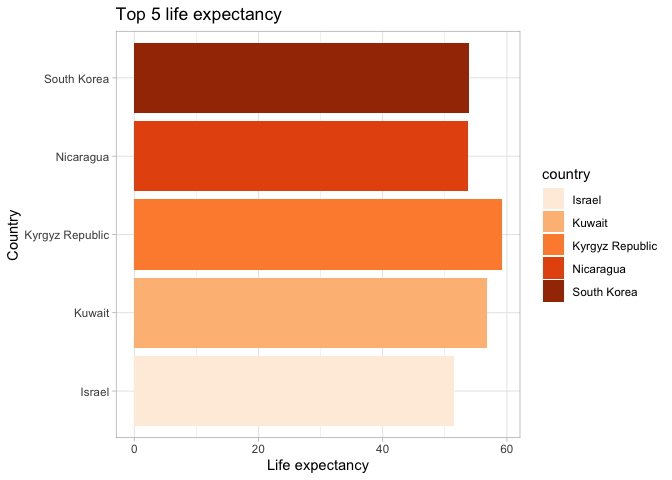
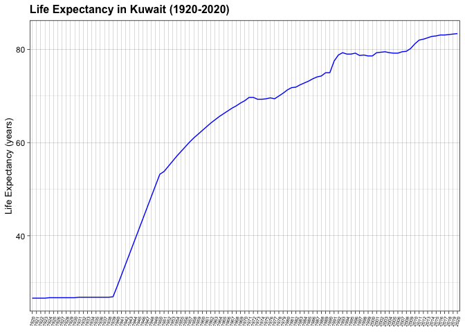
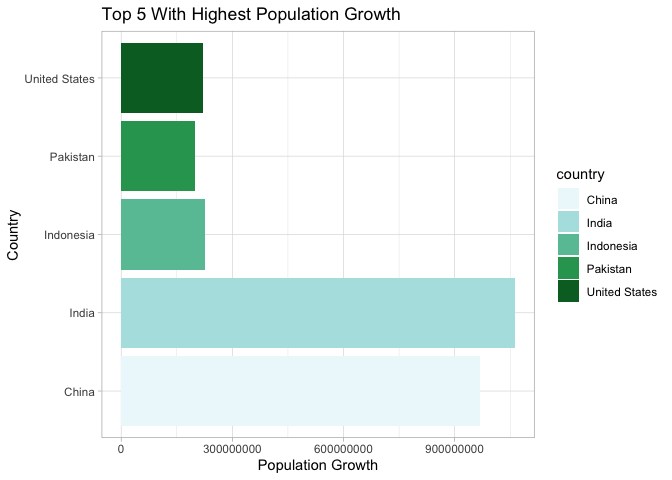
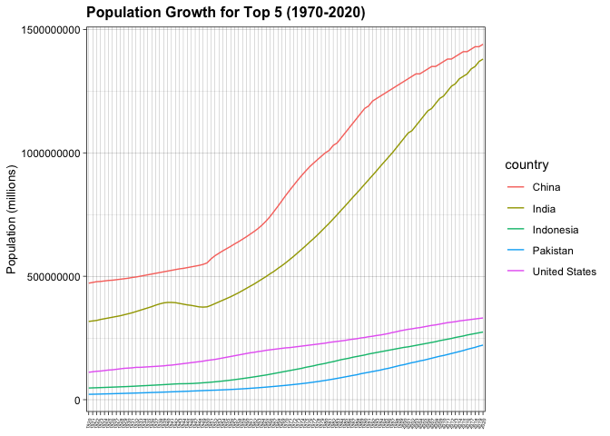
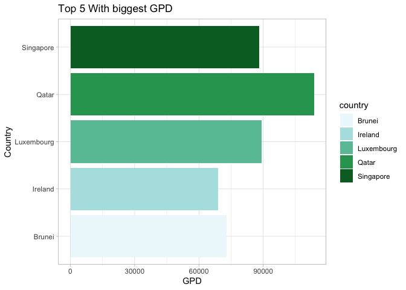
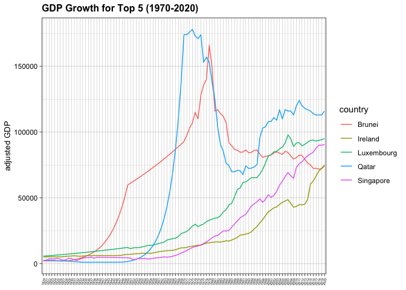
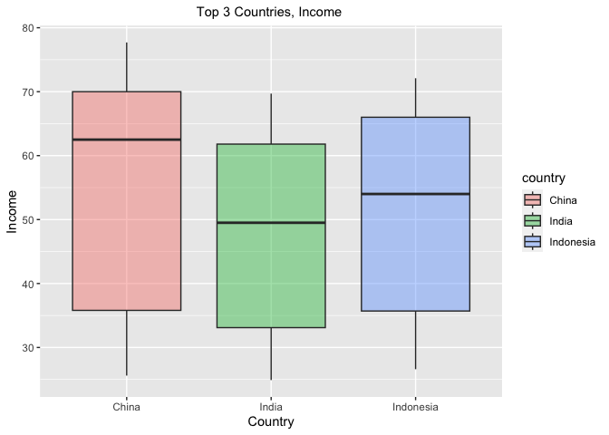

## Instructions
Answer the following questions and complete the exercises in RMarkdown. Please embed all of your code and push your final work to your repository. Your code should be organized, clean, and run free from errors. Be sure to **add your name** to the author header above. You may use any resources to answer these questions (including each other), but you may not post questions to Open Stacks or external help sites. There are 10 total questions.  

Make sure to use the formatting conventions of RMarkdown to make your report neat and clean! Your plots should use consistent aesthetics throughout.  

This exam is due by **12:00p on Tuesday, February 22**.  

## Load the libraries

```r
library(tidyverse)
```

```
## ── Attaching packages ─────────────────────────────────────── tidyverse 1.3.2 ──
## ✔ ggplot2 3.4.0      ✔ purrr   1.0.1 
## ✔ tibble  3.1.8      ✔ dplyr   1.0.10
## ✔ tidyr   1.2.1      ✔ stringr 1.5.0 
## ✔ readr   2.1.3      ✔ forcats 0.5.2 
## ── Conflicts ────────────────────────────────────────── tidyverse_conflicts() ──
## ✖ dplyr::filter() masks stats::filter()
## ✖ dplyr::lag()    masks stats::lag()
```

```r
library(janitor)
```

```
## 
## Attaching package: 'janitor'
## 
## The following objects are masked from 'package:stats':
## 
##     chisq.test, fisher.test
```

```r
options(scipen=999) #disables scientific notation when printing
```


```r
library(here)
```

```
## here() starts at /Users/achichi/Desktop/BIS15W2023_gochieng clone
```

## Gapminder
For this assignment, we are going to use data from  [gapminder](https://www.gapminder.org/). Gapminder includes information about economics, population, social issues, and life expectancy from countries all over the world. We will use three data sets, so please load all three.  

1. population_total.csv  
2. income_per_person_gdppercapita_ppp_inflation_adjusted.csv  
3. life_expectancy_years.csv  

```r
here()
```

```
## [1] "/Users/achichi/Desktop/BIS15W2023_gochieng clone"
```


```r
population <- read_csv(here("practice_midterm2", "data", "population_total.csv"))
```

```
## Rows: 195 Columns: 302
## ── Column specification ────────────────────────────────────────────────────────
## Delimiter: ","
## chr   (1): country
## dbl (301): 1800, 1801, 1802, 1803, 1804, 1805, 1806, 1807, 1808, 1809, 1810,...
## 
## ℹ Use `spec()` to retrieve the full column specification for this data.
## ℹ Specify the column types or set `show_col_types = FALSE` to quiet this message.
```


```r
income <- read_csv(here("practice_midterm2", "data", "income_per_person_gdppercapita_ppp_inflation_adjusted.csv"))
```

```
## Rows: 193 Columns: 242
## ── Column specification ────────────────────────────────────────────────────────
## Delimiter: ","
## chr   (1): country
## dbl (241): 1800, 1801, 1802, 1803, 1804, 1805, 1806, 1807, 1808, 1809, 1810,...
## 
## ℹ Use `spec()` to retrieve the full column specification for this data.
## ℹ Specify the column types or set `show_col_types = FALSE` to quiet this message.
```


```r
life_expectancy <- read_csv(here("practice_midterm2", "data", "life_expectancy_years.csv"))
```

```
## Rows: 187 Columns: 302
## ── Column specification ────────────────────────────────────────────────────────
## Delimiter: ","
## chr   (1): country
## dbl (301): 1800, 1801, 1802, 1803, 1804, 1805, 1806, 1807, 1808, 1809, 1810,...
## 
## ℹ Use `spec()` to retrieve the full column specification for this data.
## ℹ Specify the column types or set `show_col_types = FALSE` to quiet this message.
```

1. (3 points) Once you have an idea of the structure of the data, please make each data set tidy (hint: think back to pivots) and store them as new objects. You will need both the original (wide) and tidy (long) data!  


```r
population_long <- population %>% 
  pivot_longer(-country,
               names_to = "year",
               values_to = "population")%>% 
  mutate(country=as_factor(country))
population_long
```

```
## # A tibble: 58,695 × 3
##    country     year  population
##    <fct>       <chr>      <dbl>
##  1 Afghanistan 1800     3280000
##  2 Afghanistan 1801     3280000
##  3 Afghanistan 1802     3280000
##  4 Afghanistan 1803     3280000
##  5 Afghanistan 1804     3280000
##  6 Afghanistan 1805     3280000
##  7 Afghanistan 1806     3280000
##  8 Afghanistan 1807     3280000
##  9 Afghanistan 1808     3280000
## 10 Afghanistan 1809     3280000
## # … with 58,685 more rows
```


```r
income_long <- income %>% 
  pivot_longer(-country,
               names_to = "year",
               values_to = "income")%>% 
  mutate(country=as_factor(country))
income_long
```

```
## # A tibble: 46,513 × 3
##    country     year  income
##    <fct>       <chr>  <dbl>
##  1 Afghanistan 1800     603
##  2 Afghanistan 1801     603
##  3 Afghanistan 1802     603
##  4 Afghanistan 1803     603
##  5 Afghanistan 1804     603
##  6 Afghanistan 1805     603
##  7 Afghanistan 1806     603
##  8 Afghanistan 1807     603
##  9 Afghanistan 1808     603
## 10 Afghanistan 1809     603
## # … with 46,503 more rows
```


```r
structure(life_expectancy)
```

```
## # A tibble: 187 × 302
##    country `1800` `1801` `1802` `1803` `1804` `1805` `1806` `1807` `1808` `1809`
##    <chr>    <dbl>  <dbl>  <dbl>  <dbl>  <dbl>  <dbl>  <dbl>  <dbl>  <dbl>  <dbl>
##  1 Afghan…   28.2   28.2   28.2   28.2   28.2   28.2   28.1   28.1   28.1   28.1
##  2 Albania   35.4   35.4   35.4   35.4   35.4   35.4   35.4   35.4   35.4   35.4
##  3 Algeria   28.8   28.8   28.8   28.8   28.8   28.8   28.8   28.8   28.8   28.8
##  4 Andorra   NA     NA     NA     NA     NA     NA     NA     NA     NA     NA  
##  5 Angola    27     27     27     27     27     27     27     27     27     27  
##  6 Antigu…   33.5   33.5   33.5   33.5   33.5   33.5   33.5   33.5   33.5   33.5
##  7 Argent…   33.2   33.2   33.2   33.2   33.2   33.2   33.2   33.2   33.2   33.2
##  8 Armenia   34     34     34     34     34     34     34     34     34     34  
##  9 Austra…   34     34     34     34     34     34     34     34     34     34  
## 10 Austria   34.4   34.4   34.4   34.4   34.4   34.4   34.4   34.4   34.4   34.4
## # … with 177 more rows, and 291 more variables: `1810` <dbl>, `1811` <dbl>,
## #   `1812` <dbl>, `1813` <dbl>, `1814` <dbl>, `1815` <dbl>, `1816` <dbl>,
## #   `1817` <dbl>, `1818` <dbl>, `1819` <dbl>, `1820` <dbl>, `1821` <dbl>,
## #   `1822` <dbl>, `1823` <dbl>, `1824` <dbl>, `1825` <dbl>, `1826` <dbl>,
## #   `1827` <dbl>, `1828` <dbl>, `1829` <dbl>, `1830` <dbl>, `1831` <dbl>,
## #   `1832` <dbl>, `1833` <dbl>, `1834` <dbl>, `1835` <dbl>, `1836` <dbl>,
## #   `1837` <dbl>, `1838` <dbl>, `1839` <dbl>, `1840` <dbl>, `1841` <dbl>, …
```

```r
life_expectancy_long <- life_expectancy %>% 
  pivot_longer(-country,
               names_to = "year",
               values_to = "life_expectancy")%>% 
  mutate(country=as_factor(country))
life_expectancy_long
```

```
## # A tibble: 56,287 × 3
##    country     year  life_expectancy
##    <fct>       <chr>           <dbl>
##  1 Afghanistan 1800             28.2
##  2 Afghanistan 1801             28.2
##  3 Afghanistan 1802             28.2
##  4 Afghanistan 1803             28.2
##  5 Afghanistan 1804             28.2
##  6 Afghanistan 1805             28.2
##  7 Afghanistan 1806             28.1
##  8 Afghanistan 1807             28.1
##  9 Afghanistan 1808             28.1
## 10 Afghanistan 1809             28.1
## # … with 56,277 more rows
```

2. (1 point) How many different countries are represented in the data? Provide the total number and their names. Since each data set includes different numbers of countries, you will need to do this for each one.  


```r
population_long %>%
  summarize(n_countries=n_distinct(country))
```

```
## # A tibble: 1 × 1
##   n_countries
##         <int>
## 1         195
```


```r
population_long %>%
  count(country) %>%
  select(country)
```

```
## # A tibble: 195 × 1
##    country            
##    <fct>              
##  1 Afghanistan        
##  2 Albania            
##  3 Algeria            
##  4 Andorra            
##  5 Angola             
##  6 Antigua and Barbuda
##  7 Argentina          
##  8 Armenia            
##  9 Australia          
## 10 Austria            
## # … with 185 more rows
```


```r
income_long %>%
  summarize(n_countries=n_distinct(country))
```

```
## # A tibble: 1 × 1
##   n_countries
##         <int>
## 1         193
```


```r
income_long %>%
  count(country) %>%
  select(country)
```

```
## # A tibble: 193 × 1
##    country            
##    <fct>              
##  1 Afghanistan        
##  2 Albania            
##  3 Algeria            
##  4 Andorra            
##  5 Angola             
##  6 Antigua and Barbuda
##  7 Argentina          
##  8 Armenia            
##  9 Australia          
## 10 Austria            
## # … with 183 more rows
```


```r
life_expectancy_long %>%
  summarize(n_countries=n_distinct(country))
```

```
## # A tibble: 1 × 1
##   n_countries
##         <int>
## 1         187
```


```r
life_expectancy_long %>%
  count(country) %>%
  select(country)
```

```
## # A tibble: 187 × 1
##    country            
##    <fct>              
##  1 Afghanistan        
##  2 Albania            
##  3 Algeria            
##  4 Andorra            
##  5 Angola             
##  6 Antigua and Barbuda
##  7 Argentina          
##  8 Armenia            
##  9 Australia          
## 10 Austria            
## # … with 177 more rows
```

## Life Expectancy  

3. (CORRECT) (2 points) Let's limit the data to 100 years (1920-2020). For these years, which country has the highest average life expectancy? How about the lowest average life expectancy?  

Highest

```r
life_expectancy_long %>% 
  group_by(country) %>% 
  filter(between(year, 1920, 2020)) %>% # for between use the function filter(year==1922 | year==2020)
  summarize (avg_life_expectancy = mean(life_expectancy,na.rm = F)) %>% 
  arrange (desc(avg_life_expectancy)) %>% 
  head(1)#this last part is just for aesthetics you could always ignore her
```

```
## # A tibble: 1 × 2
##   country avg_life_expectancy
##   <fct>                 <dbl>
## 1 Sweden                 73.5
```
Lowest

```r
life_expectancy_long %>% 
  group_by(country) %>% 
  filter(between(year, 1920, 2020)) %>% 
  summarize (avg_life_expectancy = mean(life_expectancy)) %>% # Initially you put, na.rm = T this removes any NA so if they ask you this use it to remove the NA otherwise dont write anything
  arrange ((avg_life_expectancy)) %>% #for just the lowest remove the desc 
  head(1)# this last part is just for aesthetics you could always ignore her 
```

```
## # A tibble: 1 × 2
##   country                  avg_life_expectancy
##   <fct>                                  <dbl>
## 1 Central African Republic                41.8
```
Extra Notes 

```r
life_expectancy_long %>% 
  filter(between(year, 1920, 2020)) %>% 
  group_by(country) %>% 
  summarize(mean_life_expectancy=mean(life_expectancy)) %>% 
  arrange(desc(mean_life_expectancy))
```

```
## # A tibble: 187 × 2
##    country        mean_life_expectancy
##    <fct>                         <dbl>
##  1 Sweden                         73.5
##  2 Norway                         73.2
##  3 Netherlands                    73.0
##  4 Iceland                        72.9
##  5 Australia                      72.7
##  6 Switzerland                    72.7
##  7 Denmark                        71.9
##  8 Canada                         71.8
##  9 New Zealand                    71.4
## 10 United Kingdom                 71.1
## # … with 177 more rows
```

```r
# teachers code, was a bit off in mine by placing Na.rm= T
```

4.(Incorrect) (3 points) Although we can see which country has the highest life expectancy for the past 100 years, we don't know which countries have changed the most. What are the top 5 countries that have experienced the biggest improvement in life expectancy between 1920-2020?  
(unfortunately here )

```r
life_expectancy_long %>% 
  select(country, year, life_expectancy) %>% 
  filter(year==1922 | year==2020) %>% 
  group_by(country) %>% 
  summarize(large_life_expectancy=diff(life_expectancy),.groups = 'keep') %>% 
  arrange(desc(large_life_expectancy)) %>% 
  head(n=5)
```

```
## # A tibble: 5 × 2
## # Groups:   country [5]
##   country         large_life_expectancy
##   <fct>                           <dbl>
## 1 Kyrgyz Republic                  59.2
## 2 Kuwait                           56.8
## 3 South Korea                      53.9
## 4 Nicaragua                        53.8
## 5 Israel                           51.4
```

```r
# copied from lab 11 question 8 
```
- Correct code chunk

```r
life_expectancy_long %>% 
  filter(between(year, 1920, 2020)) %>% 
  pivot_wider(names_from = year,
              values_from = life_expectancy) %>% 
  select(country, `1920`, `2020`) %>% 
  mutate(delta=`2020`-`1920`) %>% 
  top_n(5, delta)
```

```
## # A tibble: 5 × 4
##   country         `1920` `2020` delta
##   <fct>            <dbl>  <dbl> <dbl>
## 1 Kuwait            26.6   83.4  56.8
## 2 Kyrgyz Republic   16.6   73.1  56.5
## 3 South Korea       28.2   83.2  55  
## 4 Tajikistan        16.7   71    54.3
## 5 Turkmenistan      15.2   70.5  55.3
```

5. (Incorrect)(3 points) Make a plot that shows the change over the past 100 years for the country with the biggest improvement in life expectancy. Be sure to add appropriate aesthetics to make the plot clean and clear. Once you have made the plot, do a little internet searching and see if you can discover what historical event may have contributed to this remarkable change.  


```r
top_life_expectancy_long <-life_expectancy_long %>% 
  select(country, year, life_expectancy) %>% 
  filter(year==1922 | year==2020) %>% 
  group_by(country) %>% 
  summarize(large_life_expectancy=diff(life_expectancy),.groups = 'keep') %>% 
  arrange(desc(large_life_expectancy)) %>% 
  head(n=5)
```


```r
top_life_expectancy_long %>% 
  ggplot(aes(x=country, y=large_life_expectancy, fill=country))+
  geom_col()+coord_flip()+
  scale_fill_brewer(palette = "Oranges")+
  theme_light()+
  labs(title = "Top 5 life expectancy",
       x = "Country",
       y = "Life expectancy")
```

<!-- -->
Extra Notes 
- correct  code chunk 


_In 1938, oil was discovered in Kuwait._  


```r
kuwait <- life_expectancy_long %>% 
  filter(country=="Kuwait") %>% 
  filter(between(year, 1920, 2020)) %>%
  select(year, life_expectancy)%>% 
  ggplot(aes(x=year, y=life_expectancy, group=1))+
  geom_line(color="blue")
```


```r
kuwait +
  theme_linedraw()+
  theme(plot.title = element_text(size = 12, face = "bold"),
        axis.title = element_text(size = 10),
        axis.text.x = element_text(angle=75, hjust = 1, size=5)) +
  labs(title = "Life Expectancy in Kuwait (1920-2020)",
       x = NULL,
       y = "Life Expectancy (years)")
```

<!-- -->
## Population Growth
6. (Correct my code:) (3 points) Which 5 countries have had the highest population growth over the past 100 years (1920-2020)?  

```r
population_long %>% 
  filter(year==1920 | year==2020) %>% 
  group_by(country) %>% 
  summarize(large_pop_growth=diff(population),.groups = 'keep') %>% 
  arrange(desc(large_pop_growth)) %>% 
  head(n=5)
```

```
## # A tibble: 5 × 2
## # Groups:   country [5]
##   country       large_pop_growth
##   <fct>                    <dbl>
## 1 India               1063000000
## 2 China                968000000
## 3 Indonesia            226700000
## 4 United States        220000000
## 5 Pakistan             199300000
```

7. (Incorrect) (4 points) Produce a plot that shows the 5 countries that have had the highest population growth over the past 100 years (1920-2020). Which countries appear to have had exponential growth?  


```r
top_population_long<-population_long %>% 
  filter(year==1920 | year==2020) %>% 
  group_by(country) %>% 
  summarize(large_pop_growth=diff(population),.groups = 'keep') %>% 
  arrange(desc(large_pop_growth)) %>% 
  head(n=5)
```


```r
top_population_long %>% 
  ggplot(aes(x=country, y=large_pop_growth, fill=country))+
  geom_col()+coord_flip()+
  scale_fill_brewer(palette = "BuGn")+
  theme_light()+
  labs(title = "Top 5 With Highest Population Growth",
       x = "Country",
       y = "Population Growth")
```

<!-- -->
Notes
- they asked for an exponential groth meaning geom line would have been the more appropriate tool to utilize with this question 
Correct code chunk

```r
population %>% 
  filter(country=="India" | country=="China" | country=="Pakistan" | country=="Indonesia" | country=="United States") %>% 
  pivot_longer(-country,
               names_to = "year",
               values_to="population") %>% 
  filter(year>=1920 & year<=2020) %>% 
  ggplot(aes(x=year, y=population, group=country, color=country))+
  geom_line()+
  theme_linedraw()+
  theme(plot.title = element_text(size = 12, face = "bold"),
        axis.title = element_text(size = 10),
        axis.text.x = element_text(angle=75, hjust = 1, size=4)) +
  labs(title = "Population Growth for Top 5 (1970-2020)",
       x = NULL,
       y = "Population (millions)")
```

<!-- -->

```r
# China did also india
```

## Income
The units used for income are gross domestic product per person adjusted for differences in purchasing power in international dollars.

8. (Semi- correct) (4 points) As in the previous questions, which countries have experienced the biggest growth in per person GDP. Show this as a table and then plot the changes for the top 5 countries. With a bit of research, you should be able to explain the dramatic downturns of the wealthiest economies that occurred during the 1980's.  

```r
top_income_long<-income_long %>% 
  filter(year==1920 | year==2020) %>% 
  group_by(country) %>% 
  summarize(large_income_growth=diff(income),.groups = 'keep') %>% 
  arrange(desc(large_income_growth)) %>% 
  head(n=5)
```


```r
top_income_long %>% 
  ggplot(aes(x=country, y=large_income_growth, fill=country))+
  geom_col()+coord_flip()+
  scale_fill_brewer(palette = "BuGn")+
  theme_light()+
  labs(title = "Top 5 With biggest GPD",
       x = "Country",
       y = "GPD")
```

<!-- -->
- Once again they want an explanation of some down towns meaning this bar does not show how some increased the decreased and for that we need 

```r
income %>% 
  filter(country=="Qatar" | country=="Luxembourg" | country=="Singapore" | country=="Brunei" | country=="Ireland") %>% 
  pivot_longer(-country,
               names_to = "year",
               values_to="income") %>% 
  filter(year>=1920 & year<=2020) %>% 
  ggplot(aes(x=as.factor(year), y=income, group=country, color=country))+
  geom_line()+
  theme_linedraw()+
  theme(plot.title = element_text(size = 12, face = "bold"),
        axis.title = element_text(size = 10),
        axis.text.x = element_text(angle=75, hjust = 1, size=4)) +
  labs(title = "GDP Growth for Top 5 (1970-2020)",
       x = NULL,
       y = "adjusted GDP") 
```

<!-- -->


9.(CORRECT) (3 points) Create three new objects that restrict each data set (life expectancy, population, income) to the years 1920-2020. Hint: I suggest doing this with the long form of your data. Once this is done, merge all three data sets using the code I provide below. You may need to adjust the code depending on how you have named your objects. I called mine `life_expectancy_100`, `population_100`, and `income_100`. For some of you, learning these `joins` will be important for your project.  

```r
population_final <- population_long %>% 
  filter(between(year, 1920, 2020))
 population_final
```

```
## # A tibble: 19,695 × 3
##    country     year  population
##    <fct>       <chr>      <dbl>
##  1 Afghanistan 1920    10600000
##  2 Afghanistan 1921    10500000
##  3 Afghanistan 1922    10300000
##  4 Afghanistan 1923     9710000
##  5 Afghanistan 1924     9200000
##  6 Afghanistan 1925     8720000
##  7 Afghanistan 1926     8260000
##  8 Afghanistan 1927     7830000
##  9 Afghanistan 1928     7420000
## 10 Afghanistan 1929     7100000
## # … with 19,685 more rows
```

```r
# New column created
```


```r
life_expectancy_final <- life_expectancy_long %>% 
  filter(between(year, 1920, 2020))
 life_expectancy_final
```

```
## # A tibble: 18,887 × 3
##    country     year  life_expectancy
##    <fct>       <chr>           <dbl>
##  1 Afghanistan 1920             30.6
##  2 Afghanistan 1921             30.7
##  3 Afghanistan 1922             30.8
##  4 Afghanistan 1923             30.8
##  5 Afghanistan 1924             30.9
##  6 Afghanistan 1925             31  
##  7 Afghanistan 1926             31  
##  8 Afghanistan 1927             31.1
##  9 Afghanistan 1928             31.1
## 10 Afghanistan 1929             31.2
## # … with 18,877 more rows
```


```r
income_final <- income_long %>% 
  filter(between(year, 1920, 2020)) # arranges from the years selected
 income_final
```

```
## # A tibble: 19,493 × 3
##    country     year  income
##    <fct>       <chr>  <dbl>
##  1 Afghanistan 1920    1490
##  2 Afghanistan 1921    1520
##  3 Afghanistan 1922    1550
##  4 Afghanistan 1923    1570
##  5 Afghanistan 1924    1600
##  6 Afghanistan 1925    1630
##  7 Afghanistan 1926    1650
##  8 Afghanistan 1927    1680
##  9 Afghanistan 1928    1710
## 10 Afghanistan 1929    1740
## # … with 19,483 more rows
```


```r
gapminder_join <- inner_join(life_expectancy_final, population_final, by= c("country", "year"))
gapminder_join <- inner_join(gapminder_join, income_final, by= c("country", "year"))
gapminder_join
```

```
## # A tibble: 18,887 × 5
##    country     year  life_expectancy population income
##    <fct>       <chr>           <dbl>      <dbl>  <dbl>
##  1 Afghanistan 1920             30.6   10600000   1490
##  2 Afghanistan 1921             30.7   10500000   1520
##  3 Afghanistan 1922             30.8   10300000   1550
##  4 Afghanistan 1923             30.8    9710000   1570
##  5 Afghanistan 1924             30.9    9200000   1600
##  6 Afghanistan 1925             31      8720000   1630
##  7 Afghanistan 1926             31      8260000   1650
##  8 Afghanistan 1927             31.1    7830000   1680
##  9 Afghanistan 1928             31.1    7420000   1710
## 10 Afghanistan 1929             31.2    7100000   1740
## # … with 18,877 more rows
```

10. (4 points) Use the joined data to perform an analysis of your choice. The analysis should include a comparison between two or more of the variables `life_expectancy`, `population`, or `income.`  


```r
gapminder_filter<- gapminder_join %>% 
   filter(country=="China"| country=="India"|country=="Indonesia") %>%
  select(country, income,life_expectancy)
```


```r
gapminder_filter %>% 
  ggplot(aes(x=country, y=life_expectancy, fill=country))+
  geom_boxplot(alpha=0.4)+ 
labs(title = "Top 3 Countries, Income ",
       x = "Country",
       y = "Income")+
  theme(plot.title = element_text(size = rel(1), hjust = 0.5))
```

<!-- -->


Cocept Finder keys 
Looking for 
7- Fun with Na's and introduction to naniar
8- pivotting wider and longer if its wide pivot longer and vise versa
9- Data Visualization GGplot
10-Data Visualization GGplot
11-Data Visualization GGplot

Online ggplot chart 
##Resources  
- [ggplot2 cheatsheet](https://posit.co/resources/cheatsheets/)  
codes for color


