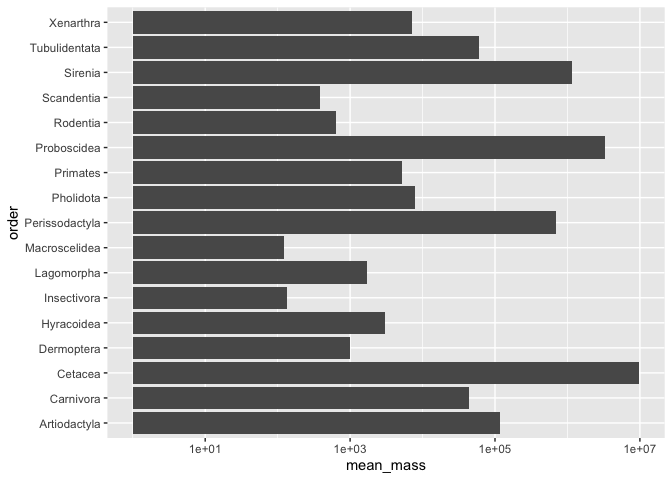
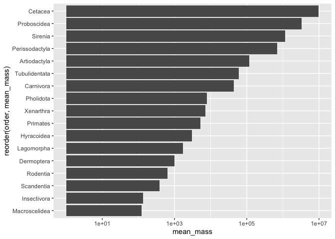
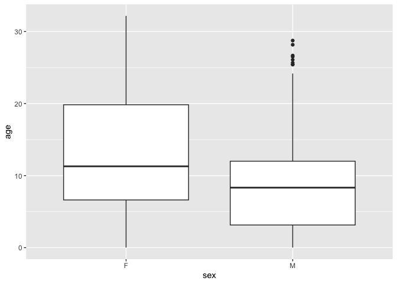
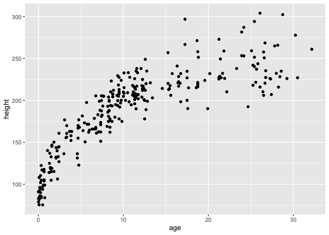
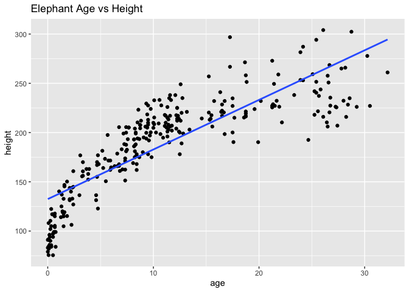
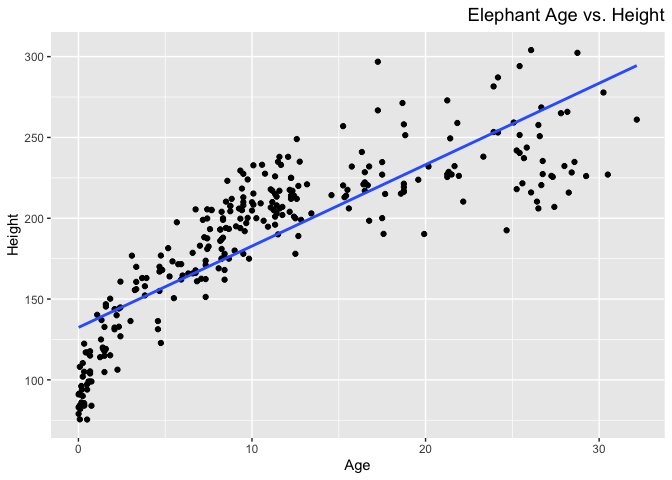
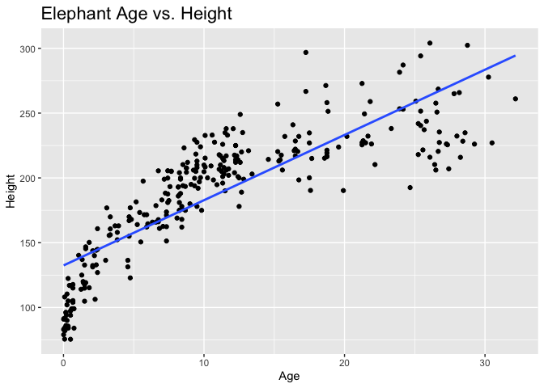

## Learning Goals
*At the end of this exercise, you will be able to:*    
1. Produce box plots using `ggplot.`  
2. Customize labels on axes using `labs` and `themes`.  
3. Use `color`, `fill`, and `group` to customize plots and improve overall aesthetics.  

## Review
Now that you have been introduced to `ggplot`, let's review the plot types from last week and learn how to manipulate their aesthetics to better suit our needs. Aesthetics make a significant difference, but you can take it too far so remember that the goal is to produce clean plots that are not distracting.  

##Resources
- [ggplot2 cheatsheet](https://www.rstudio.com/wp-content/uploads/2015/03/ggplot2-cheatsheet.pdf)
- [`ggplot` themes](https://ggplot2.tidyverse.org/reference/ggtheme.html)
- [Rebecca Barter `ggplot` Tutorial](http://www.rebeccabarter.com/blog/2017-11-17-ggplot2_tutorial/)

## Load the libraries

```r
library(tidyverse)
library(janitor)
```

## Load the data
Let's revisit the mammal life history data to practice our ggplot skills. The [data](http://esapubs.org/archive/ecol/E084/093/) are from: *S. K. Morgan Ernest. 2003. Life history characteristics of placental non-volant mammals. Ecology 84:3402.*

```r
life_history <- read_csv("data/mammal_lifehistories_v2.csv", na="-999") %>% clean_names()
```


```r
glimpse(life_history)
```

```
## Rows: 1,440
## Columns: 13
## $ order        <chr> "Artiodactyla", "Artiodactyla", "Artiodactyla", "Artiodac…
## $ family       <chr> "Antilocapridae", "Bovidae", "Bovidae", "Bovidae", "Bovid…
## $ genus        <chr> "Antilocapra", "Addax", "Aepyceros", "Alcelaphus", "Ammod…
## $ species      <chr> "americana", "nasomaculatus", "melampus", "buselaphus", "…
## $ mass         <dbl> 45375.0, 182375.0, 41480.0, 150000.0, 28500.0, 55500.0, 3…
## $ gestation    <dbl> 8.13, 9.39, 6.35, 7.90, 6.80, 5.08, 5.72, 5.50, 8.93, 9.1…
## $ newborn      <dbl> 3246.36, 5480.00, 5093.00, 10166.67, NA, 3810.00, 3910.00…
## $ weaning      <dbl> 3.00, 6.50, 5.63, 6.50, NA, 4.00, 4.04, 2.13, 10.71, 6.60…
## $ wean_mass    <dbl> 8900, NA, 15900, NA, NA, NA, NA, NA, 157500, NA, NA, NA, …
## $ afr          <dbl> 13.53, 27.27, 16.66, 23.02, NA, 14.89, 10.23, 20.13, 29.4…
## $ max_life     <dbl> 142, 308, 213, 240, NA, 251, 228, 255, 300, 324, 300, 314…
## $ litter_size  <dbl> 1.85, 1.00, 1.00, 1.00, 1.00, 1.37, 1.00, 1.00, 1.00, 1.0…
## $ litters_year <dbl> 1.00, 0.99, 0.95, NA, NA, 2.00, NA, 1.89, 1.00, 1.00, 0.7…
```

## Bar Plots
Bar plots count the number of observations in a categorical variable.

```r
life_history %>% 
  count(order, sort=T)
```

```
## # A tibble: 17 × 2
##    order              n
##    <chr>          <int>
##  1 Rodentia         665
##  2 Carnivora        197
##  3 Artiodactyla     161
##  4 Primates         156
##  5 Insectivora       91
##  6 Cetacea           55
##  7 Lagomorpha        42
##  8 Xenarthra         20
##  9 Perissodactyla    15
## 10 Macroscelidea     10
## 11 Pholidota          7
## 12 Scandentia         7
## 13 Sirenia            5
## 14 Hyracoidea         4
## 15 Dermoptera         2
## 16 Proboscidea        2
## 17 Tubulidentata      1
```

```r
#F sorts them alphabetically 
```


```r
life_history %>% 
  ggplot(aes(x=order))+
  geom_bar()+
  coord_flip()
```

<!-- -->


```r
life_history %>% 
  group_by(order) %>% 
  summarize(mean_mass=mean(mass, na.rm=T))
```

```
## # A tibble: 17 × 2
##    order          mean_mass
##    <chr>              <dbl>
##  1 Artiodactyla     115843.
##  2 Carnivora         43382.
##  3 Cetacea         9830457.
##  4 Dermoptera         1000 
##  5 Hyracoidea         3031.
##  6 Insectivora         133.
##  7 Lagomorpha         1702.
##  8 Macroscelidea       124.
##  9 Perissodactyla   694487.
## 10 Pholidota          7980 
## 11 Primates           5145.
## 12 Proboscidea     3342500 
## 13 Rodentia            637.
## 14 Scandentia          389.
## 15 Sirenia         1169400 
## 16 Tubulidentata     60000 
## 17 Xenarthra          7238.
```


```r
life_history %>% 
  group_by(order) %>% 
  summarize(mean_mass=mean(mass, na.rm=T)) %>% 
  ggplot(aes(x=order, y=mean_mass))+
  geom_col()+
  coord_flip()+
  scale_y_log10()#this last sentence scales so there is not much distinction
```

<!-- -->


```r
 life_history %>% 
  group_by(order) %>% 
  summarize(mean_mass=mean(mass, na.rm=T)) %>% 
  ggplot(aes(x=reorder(order,mean_mass), y=mean_mass))+ # its aesthetically pleasing ordering by value
  geom_col()+
  coord_flip()+
  scale_y_log10()
```

<!-- -->


```r
options(scipen=999)
# cancels scientific notation for the session (so that R does not use it )
```

## Scatterplots
Scatter plots allow for comparisons of two continuous variables.

```r
life_history %>% 
  ggplot(aes(x=gestation,y=wean_mass))+
  geom_point(na.m=T)+
  scale_y_log10()# without adding this scale_mass_log10 it doesnt provide a clear data we just like zoomed in to see the values better
```

```
## Warning in geom_point(na.m = T): Ignoring unknown parameters: `na.m`
```

```
## Warning: Removed 1066 rows containing missing values (`geom_point()`).
```

<!-- -->

## Boxplots
Box plots help us visualize a range of values. So, on the x-axis we typically have something categorical and the y-axis is the range.

```r
glimpse(life_history)
```

```
## Rows: 1,440
## Columns: 13
## $ order        <chr> "Artiodactyla", "Artiodactyla", "Artiodactyla", "Artiodac…
## $ family       <chr> "Antilocapridae", "Bovidae", "Bovidae", "Bovidae", "Bovid…
## $ genus        <chr> "Antilocapra", "Addax", "Aepyceros", "Alcelaphus", "Ammod…
## $ species      <chr> "americana", "nasomaculatus", "melampus", "buselaphus", "…
## $ mass         <dbl> 45375.0, 182375.0, 41480.0, 150000.0, 28500.0, 55500.0, 3…
## $ gestation    <dbl> 8.13, 9.39, 6.35, 7.90, 6.80, 5.08, 5.72, 5.50, 8.93, 9.1…
## $ newborn      <dbl> 3246.36, 5480.00, 5093.00, 10166.67, NA, 3810.00, 3910.00…
## $ weaning      <dbl> 3.00, 6.50, 5.63, 6.50, NA, 4.00, 4.04, 2.13, 10.71, 6.60…
## $ wean_mass    <dbl> 8900, NA, 15900, NA, NA, NA, NA, NA, 157500, NA, NA, NA, …
## $ afr          <dbl> 13.53, 27.27, 16.66, 23.02, NA, 14.89, 10.23, 20.13, 29.4…
## $ max_life     <dbl> 142, 308, 213, 240, NA, 251, 228, 255, 300, 324, 300, 314…
## $ litter_size  <dbl> 1.85, 1.00, 1.00, 1.00, 1.00, 1.37, 1.00, 1.00, 1.00, 1.0…
## $ litters_year <dbl> 1.00, 0.99, 0.95, NA, NA, 2.00, NA, 1.89, 1.00, 1.00, 0.7…
```


```r
life_history %>% 
  ggplot(aes(x=order, y=mass))+
  geom_boxplot(na.rm=T)+
  coord_flip()+
  scale_y_log10()
```

<!-- -->

```r
#life_history %>% 
  #filter(order= Cetacea)
 # ggplot(aes(x=order, y=mass))+
 # geom_boxplot(na.rm=T)+
 # coord_flip()+
  #scale_y_log10()
```

Remember, you can always use dplyr functions to focus your question, summarize, etc.


## Practice  
For this practice, let's use the `ElephantsMF` data. These data are from Phyllis Lee, Stirling University, and are related to Lee, P., et al. (2013), "Enduring consequences of early experiences: 40-year effects on survival and success among African elephants (Loxodonta africana)," Biology Letters, 9: 20130011. [kaggle](https://www.kaggle.com/mostafaelseidy/elephantsmf).

```r
elephants <- read_csv("data/elephantsMF.csv") %>% clean_names()
```

```
## Rows: 288 Columns: 3
## ── Column specification ────────────────────────────────────────────────────────
## Delimiter: ","
## chr (1): Sex
## dbl (2): Age, Height
## 
## ℹ Use `spec()` to retrieve the full column specification for this data.
## ℹ Specify the column types or set `show_col_types = FALSE` to quiet this message.
```

1. How many male and female elephants are represented in the data. How would you make a plot of this?

```r
elephants %>% 
  count(sex)
```

```
## # A tibble: 2 × 2
##   sex       n
##   <chr> <int>
## 1 F       150
## 2 M       138
```

```r
#elephants %>% 
 # ggplot(aes(x=sex))+
 # geom_bar

# you would make a plot of this by 
```

2. How does the age of elephants compare by sex?

```r
elephants %>% 
  ggplot(aes(x=sex, y=age))+
  geom_boxplot() 
```

<!-- -->

```r
# go over this
```

3. What is the relationship between age and height?

```r
elephants %>% 
  ggplot(aes(x=age, y=height))+
  geom_point()
```

<!-- -->

## Aesthetics: Labels
Now that we have practiced scatter plots, bar plots, and box plots we need to learn how to adjust their appearance to suit our needs. Let's start with labeling x and y axes.  

In the example above we looked at age and height of elephants.

```r
elephants %>% 
  ggplot(aes(x=age, y=height)) + geom_point() + geom_smooth(method=lm, se=F)
```

```
## `geom_smooth()` using formula = 'y ~ x'
```

<!-- -->

The plot looks clean, but it is incomplete. A reader unfamiliar with the data might have a difficult time interpreting the labels. To add custom labels, we use the `labs` command.

```r
elephants %>% 
  ggplot(aes(x=age, y=height)) +
  geom_point() +
  geom_smooth(method=lm, se=F)+
  labs(title="Elephant Age vs Height",
       x="age",
       y="height")
```

```
## `geom_smooth()` using formula = 'y ~ x'
```

<!-- -->

We can improve the plot further by adjusting the size and face of the text. We do this using `theme()`.

```r
elephants %>% 
  ggplot(aes(x=age, y=height)) + geom_point() + geom_smooth(method=lm, se=F) +
  labs(title = "Elephant Age vs. Height",
       x = "Age",
       y = "Height") +
  theme(plot.title = element_text(size = rel(1.25), hjust = 1))# themme command gives us power over size and location of our created title 
```

```
## `geom_smooth()` using formula = 'y ~ x'
```

<!-- -->

The `rel()` option changes the relative size of the title to keep things consistent. Adding `hjust` allows control of title position.

```r
elephants %>% 
  ggplot(aes(x=age, y=height)) + geom_point() + geom_smooth(method=lm, se=F) +
  labs(title = "Elephant Age vs. Height",
       x = "Age",
       y = "Height") +
  theme(plot.title = element_text(size = rel(1.5), hjust = 0))
```

```
## `geom_smooth()` using formula = 'y ~ x'
```

<!-- -->

## Other Aesthetics
There are lots of options for aesthetics. An aesthetic can be assigned to either numeric or categorical data. `fill` is a common grouping option; notice that an appropriate key is displayed when you use one of these options.

```r
elephants %>% 
  ggplot(aes(x=sex,fill=sex))+ # by adding fill we get a color of our plotted variables 
  geom_bar()
```

<!-- -->

`size` adjusts the size of points relative to a continuous variable.

```r
life_history %>% 
  ggplot(aes(x=gestation, y=log10(mass), size=mass))+
  geom_point()
```

```
## Warning: Removed 449 rows containing missing values (`geom_point()`).
```

<!-- -->


```r
life_history %>% 
  filter(gestation>=20)
```

```
## # A tibble: 2 × 13
##   order       family  genus species   mass gesta…¹ newborn weaning wean_…²   afr
##   <chr>       <chr>   <chr> <chr>    <dbl>   <dbl>   <dbl>   <dbl>   <dbl> <dbl>
## 1 Proboscidea Elepha… Elep… maximus 3.18e6    21.1 100039.    18        NA  127.
## 2 Proboscidea Elepha… Loxo… africa… 3.51e6    21.5  99006.    39.4  600000  148.
## # … with 3 more variables: max_life <dbl>, litter_size <dbl>,
## #   litters_year <dbl>, and abbreviated variable names ¹​gestation, ²​wean_mass
```


## Practice
1. Let's finish part 1 by looking at the homerange data `Tamburelloetal_HomeRangeDatabase`. By now, these should be very familiar to you.


2. Make a barplot that shows counts of ectotherms and endotherms. Label the axes, provide a title, and fill by `thermoregulation`.


3. Make a scatterplot that compares log10.mass and homerange. Adjust the size of points by mass. Label the axes and provide a title.


## That's it! Let's take a break and then move on to part 2!  

-->[Home](https://jmledford3115.github.io/datascibiol/)
