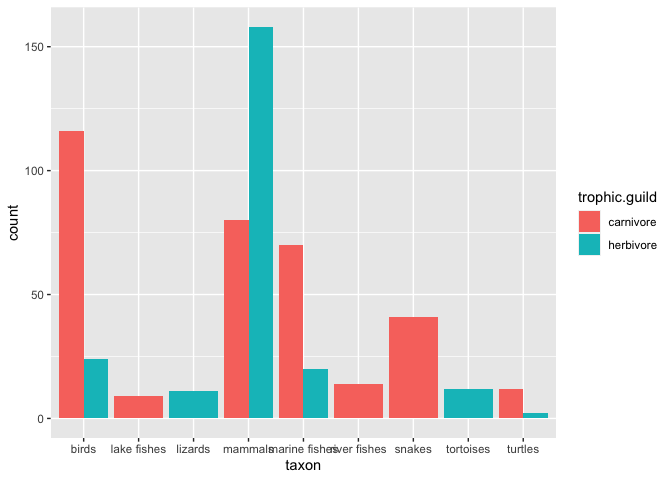
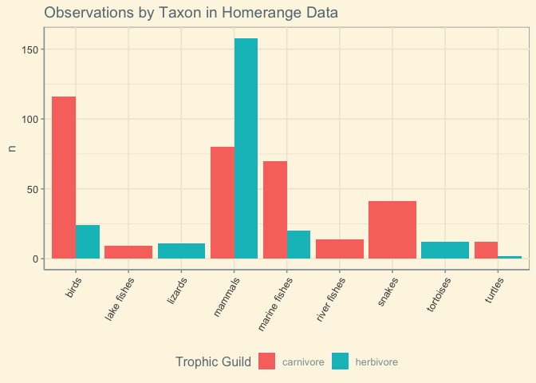
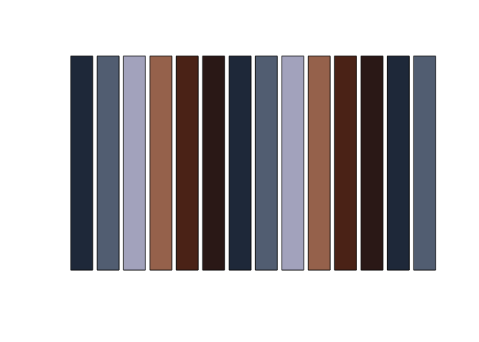
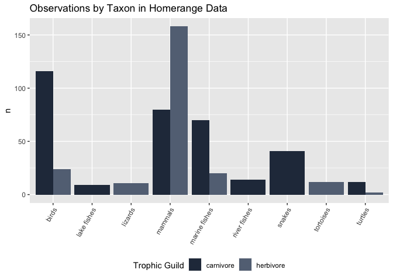
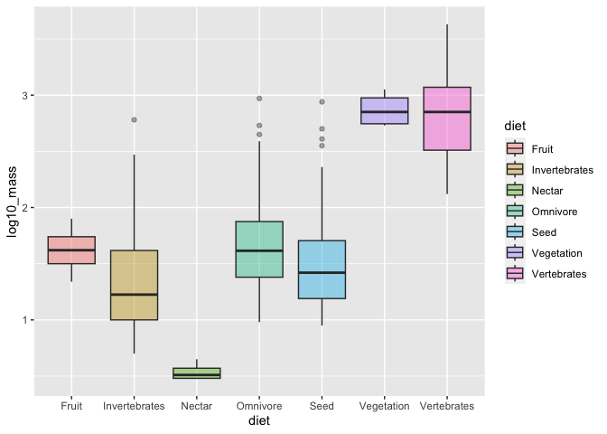
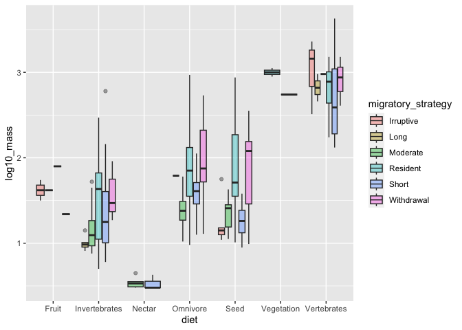

## Learning Goals
*At the end of this exercise, you will be able to:*    
1. Adjust the aesthetics of plots in ggplot using `themes`, `RColorBrewer`, and `paletteer.`  
2. Use faceting to produce multi-panel plots.  

## Group project  
We will meet in our groups today to compare the data sets that we found. You should try to pick the data set that you think will be most appropriate; i.e. does it have a mix of variables, does it have a story to tell? Once you have a data set, think about the kinds of questions you might ask. Remember, in the end you will need to deliver a 5-6 minute presentation of your work. If you need help, please ask!  

## Resources
- [ggplot2 cheatsheet](https://www.rstudio.com/wp-content/uploads/2015/03/ggplot2-cheatsheet.pdf)
- [R for Data Science](https://r4ds.had.co.nz/)
- [R Cookbook](http://www.cookbook-r.com/)
- [`ggplot` themes](https://ggplot2.tidyverse.org/reference/ggtheme.html)
- [Rebecca Barter `ggplot` Tutorial](http://www.rebeccabarter.com/blog/2017-11-17-ggplot2_tutorial/)
- [R Color Brewer](http://colorbrewer2.org/#type=sequential&scheme=BuGn&n=3)

## Load the libraries

```r
library(tidyverse)
library(RColorBrewer)
library(paletteer)
library(janitor)
library(here)
```


```r
options(scipen=999) #cancels the use of scientific notation for the session
```

## Data
For this tutorial, we will use:  
[Homerange](http://datadryad.org/resource/doi:10.5061/dryad.q5j65/1). The data are from: Tamburello N, Cote IM, Dulvy NK (2015) Energy and the scaling of animal space use. The American Naturalist 186(2):196-211. http://dx.doi.org/10.1086/682070.  

```r
homerange <- read_csv(here("lab11", "data", "Tamburelloetal_HomeRangeDatabase.csv"))
```

## ggplot themes
There are many options to change the theme of your plots. Have a look [here](https://www.datanovia.com/en/blog/ggplot-themes-gallery/) for some excellent examples. I am going to build a basic plot here and then use it throughout to illustrate the themes.

```r
p <- homerange %>% 
  ggplot(aes(x=taxon, fill=trophic.guild))+
  geom_bar(na.rm=T, position="dodge")
p
```

<!-- -->


```r
p+theme_classic()+
  theme(axis.text.x = element_text(angle = 60, hjust=1))+
  labs(title = "Observations by Taxon in Homerange Data",
       x = NULL,
       y= "n",
       fill= "Trophic Guild")
```

<!-- -->

## Legends
There are lots of options to manipulate legends. Have a look [here](http://www.sthda.com/english/wiki/ggplot2-legend-easy-steps-to-change-the-position-and-the-appearance-of-a-graph-legend-in-r-software).

```r
p+theme_linedraw()+
  theme(legend.position = "bottom",
        axis.text.x = element_text(angle = 60, hjust=1))+
  labs(title = "Observations by Taxon in Homerange Data",
       x = NULL,
       y= "n",
       fill= "Trophic Guild")
```

<!-- -->

## Not enough? [ggthemes](https://yutannihilation.github.io/allYourFigureAreBelongToUs/)

```r
#install.packages("ggthemes")
library(ggthemes)
```

Here is a list of the `ggthemes`

```r
ls("package:ggthemes")[grepl("theme_", ls("package:ggthemes"))]
```

```
##  [1] "theme_base"            "theme_calc"            "theme_clean"          
##  [4] "theme_economist"       "theme_economist_white" "theme_excel"          
##  [7] "theme_excel_new"       "theme_few"             "theme_fivethirtyeight"
## [10] "theme_foundation"      "theme_gdocs"           "theme_hc"             
## [13] "theme_igray"           "theme_map"             "theme_pander"         
## [16] "theme_par"             "theme_solarized"       "theme_solarized_2"    
## [19] "theme_solid"           "theme_stata"           "theme_tufte"          
## [22] "theme_wsj"
```


```r
p+ theme_solarized()+
  theme(legend.position = "bottom",
        axis.text.x = element_text(angle = 60, hjust=1))+
  labs(title = "Observations by Taxon in Homerange Data",
       x = NULL,
       y= "n",
       fill= "Trophic Guild")
```

<!-- -->

## RColorBrewer
The default colors used by ggplot are often uninspiring. They don't make plots pop out in presentations or publications, and you may want to use a customized palette to make things visually consistent.  

Access the help for `RColorBrewer`.

```r
?RColorBrewer
```

The thing to notice is that there are three different palettes: 1) sequential, 2) diverging, and 3) qualitative. Within each of these there are several selections. You can bring up the colors by using `display.brewer.pal()`. Specify the number of colors that you want and the palette name.

```r
display.brewer.pal(4,"GnBu")
```

<!-- -->

```r
#to pick look at the help button above this helps you see the different variations of pallets t work with your work
```

```r
#display.brewer.pal(4,"4-class Paired")
```

The [R Color Brewer](http://colorbrewer2.org/#type=sequential&scheme=BuGn&n=3) website is very helpful for getting an idea of the color palettes. To make things easy, use these two guidelines:

+`scale_colour_brewer()` is for points  for points on a scatter plot
+`scale_fill_brewer()` is for fills  for bar plots

Here I chose the `Paired` palette. Take a moment and experiment with other options.

```r
p+scale_fill_brewer(palette = "BuPu")+
  theme(legend.position = "bottom",
        axis.text.x = element_text(angle = 60, hjust=1))+
  labs(title = "Observations by Taxon in Homerange Data",
       x = NULL,
       y= "n",
       fill= "Trophic Guild")
```

<!-- -->

## Manually Setting Colors
You can also use `paleteer` to build a custom palette for consistency. To access the `paleteer` collection, I add it to a new object.

```r
colors <- paletteer::palettes_d_names
```

Now we can display the palettes. Assign the palette to `my_palette` and then build this base R bar plot. There are a lot of options; `paleteer` is a collection of popular palettes. I really like the [`ggsci` package] (https://cran.r-project.org/web/packages/ggsci/vignettes/ggsci.html)

```r
my_palette <- paletteer_d("beyonce::X1")
```


```r
barplot(rep(1,14), axes=FALSE, col=my_palette)
```

<!-- -->

Now we just identify `my_palette` as part of `scale_fill_manual()`

```r
p+scale_fill_manual(values=my_palette)+
  theme(legend.position = "bottom",
        axis.text.x = element_text(angle = 60, hjust=1))+
  labs(title = "Observations by Taxon in Homerange Data",
       x = NULL,
       y= "n",
       fill= "Trophic Guild")
```

<!-- -->

## Adjusting the x and y limits
There are many options for adjusting the x and y axes. For details, look over examples in the [R Cookbook](http://www.cookbook-r.com/). To adjust limits, we can use the `xlim` and `ylim` commands. When you do this, any data outside the specified ranges are not plotted.

```r
homerange %>% 
  ggplot(aes(x = log10.mass, y = log10.hra, color = locomotion)) +
  geom_point() +
  xlim(0, 4) +
  ylim(1, 6)
```

```
## Warning: Removed 175 rows containing missing values (`geom_point()`).
```

<!-- -->

```r
# x lim and  lim only zooms in on our interested area
```

## Practice
1. Revisit the relationship between mass and homerange using a scatterplot, but color the points by taxonomic class using a custom color theme.

```r
#fix and understand this practice
```


```r
names(homerange)
```

```
##  [1] "taxon"                      "common.name"               
##  [3] "class"                      "order"                     
##  [5] "family"                     "genus"                     
##  [7] "species"                    "primarymethod"             
##  [9] "N"                          "mean.mass.g"               
## [11] "log10.mass"                 "alternative.mass.reference"
## [13] "mean.hra.m2"                "log10.hra"                 
## [15] "hra.reference"              "realm"                     
## [17] "thermoregulation"           "locomotion"                
## [19] "trophic.guild"              "dimension"                 
## [21] "preymass"                   "log10.preymass"            
## [23] "PPMR"                       "prey.size.reference"
```

2. Build bar plots that show the representation by taxonomic class with carnivores and herbivores. Try using a color theme that matches your scatterplot to keep everything consistent.

```r
m <-homerange %>% 
  ggplot(aes(x = log10.mass, y = log10.hra, color = class))
```


```r
#m+scale_fill_brewer(palette = "RdYlGn")
```

## Faceting
[Faceting](https://ggplot2-book.org/facet.html) is one of the amazing features of ggplot. It allows us to make multi-panel plots for easy comparison.  

Let's use some new data on migratory birds as an example. These data are from: [Wilman, Hamish; Belmaker, Jonathan; Simpson, Jennifer; de la Rosa, Carolina; Rivadeneira, Marcelo M.; Jetz, Walter (2016): EltonTraits 1.0: Species-level foraging attributes of the world's birds and mammals. Wiley. Collection.](https://doi.org/10.6084/m9.figshare.c.3306933.v1)  

Here we import the data and clean the names. Because these data have a header, the skip function helps with a clean import.  

```r
ecosphere <- read_csv("data/ecs21351-sup-0003-SupplementS1.csv", skip=2, col_names = T) %>% 
  clean_names() %>% 
  separate(scientific_name, into = c("genus", "species"), sep=" ") %>% 
  na.omit() # remove NA's for now
```

```
## Rows: 569 Columns: 21
## ── Column specification ────────────────────────────────────────────────────────
## Delimiter: ","
## chr (10): Order, Family, Common Name, Scientific Name, Diet, Life Expectancy...
## dbl (11): log10(mass), Mean Eggs per Clutch, Mean Age at Sexual Maturity, Po...
## 
## ℹ Use `spec()` to retrieve the full column specification for this data.
## ℹ Specify the column types or set `show_col_types = FALSE` to quiet this message.
```

```
## Warning: Expected 2 pieces. Additional pieces discarded in 16 rows [9, 64, 105,
## 245, 304, 310, 328, 331, 341, 362, 400, 401, 489, 494, 519, 538].
```


```r
names(ecosphere)
```

```
##  [1] "order"                       "family"                     
##  [3] "common_name"                 "genus"                      
##  [5] "species"                     "diet"                       
##  [7] "life_expectancy"             "habitat"                    
##  [9] "urban_affiliate"             "migratory_strategy"         
## [11] "log10_mass"                  "mean_eggs_per_clutch"       
## [13] "mean_age_at_sexual_maturity" "population_size"            
## [15] "winter_range_area"           "range_in_cbc"               
## [17] "strata"                      "circles"                    
## [19] "feeder_bird"                 "median_trend"               
## [21] "lower_95_percent_ci"         "upper_95_percent_ci"
```

What if we were interested in a comparison of diet and mass, i.e. how does the range of masses compare by different diet types?  

```r
ecosphere %>% 
  ggplot(aes(x=diet, y=log10_mass, fill=diet))+ 
  geom_boxplot(alpha=0.4)
```

<!-- -->

This is an interesting plot, but we might use a grouping function to explore the comparison to include migratory strategy.  

```r
ecosphere %>% 
  ggplot(aes(x=diet, y=log10_mass, fill=migratory_strategy))+ 
  geom_boxplot(alpha=0.4 )
```

<!-- -->

The problem is that the plot becomes very busy. It is hard to interpret with each migratory strategy mapped. We could build separate plots for each migratory strategy, but this also makes it harder to compare. Instead, we can use faceting to make a multi-panel plot.  

`facet_wrap()` makes a ribbon of panels, but you can control how you want them arranged.  

```r
ecosphere %>% 
  ggplot(aes(x=diet, y=log10_mass, fill=migratory_strategy))+ 
  geom_boxplot(alpha=0.4) + 
  facet_wrap(~migratory_strategy, ncol=6)+
  theme(axis.text.x = element_text(angle = 60, hjust = 1))+
  labs(title = "Mass by Diet and Migratory Strategy",
       x = NULL,
       y = "Log 10 Mass",
       fill = "Migratory Strategy")
```

<!-- -->

`facet_grid()` allows control over the faceted variable; it can be arranged in rows or columns.  
rows~columns

```r
ecosphere %>% 
  ggplot(aes(x=diet, y=log10_mass, fill=migratory_strategy))+ 
  geom_boxplot(alpha=0.4)+ 
  facet_grid(migratory_strategy~.)+ # by rows
  theme(axis.text.x = element_text(angle = 60, hjust = 1))+
  labs(title = "Mass by Diet and Migratory Strategy",
       x = NULL,
       y = "Log 10 Mass",
       fill = "Migratory Strategy") 
```

<!-- -->


```r
ecosphere %>% 
  ggplot(aes(x=diet, y=log10_mass, fill=migratory_strategy))+ 
  geom_boxplot(alpha=0.4)+ 
  facet_grid(.~migratory_strategy)+ # by colums
  theme(axis.text.x = element_text(angle = 60, hjust = 1))+
  labs(title = "Mass by Diet and Migratory Strategy",
       x = NULL,
       y = "Log 10 Mass",
       fill = "Migratory Strategy")
```

<!-- -->


```r
ecosphere %>% 
  ggplot(aes(x=diet, y=log10_mass, fill=migratory_strategy))+ 
  geom_boxplot(alpha=0.4)+ 
  facet_grid(migratory_strategy~.)+
  theme(axis.text.x = element_text(angle = 60, hjust = 1))+
  labs(title = "Mass by Diet and Migratory Strategy",
       x = NULL,
       y = "Log 10 Mass",
       fill = "Migratory Strategy")
```

<!-- -->

`facet_grid()` will also allow the comparison of two categorical variables, just remember a~b where a is rows and b is columns.  

```r
ecosphere %>% 
  ggplot(aes(x=log10_mass))+
  geom_density()+
  facet_grid(diet~habitat, scales = "free_y")
```

<!-- -->

## Practice
1. Build a faceted plot that shows a distribution of life expectancy by habitat type.

```r
ecosphere %>% 
  ggplot(aes(x=log10_mass))+
  geom_density()+
  facet_wrap(~habitat)
```

<!-- -->

2. Try the same plot as #1 above, but include life_expectancy~habitat.

```r
ecosphere %>% 
  ggplot(aes(x=log10_mass))+
  geom_density()+
  facet_grid(habitat~life_expectancy, scales = "free_y")
```

```
## Warning: Groups with fewer than two data points have been dropped.
```

```
## Warning in max(ids, na.rm = TRUE): no non-missing arguments to max; returning
## -Inf
```

<!-- -->

## That's it, let's take a break!   

-->[Home](https://jmledford3115.github.io/datascibiol/)
