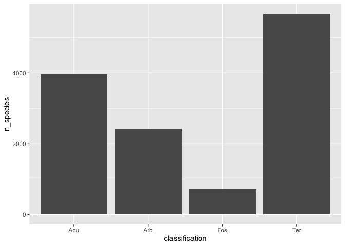

## Instructions
Answer the following questions and complete the exercises in RMarkdown. Please embed all of your code and push your final work to your repository. Your final lab report should be organized, clean, and run free from errors. Remember, you must remove the `#` for the included code chunks to run. Be sure to add your name to the author header above.  

Make sure to use the formatting conventions of RMarkdown to make your report neat and clean!  

## Load the libraries

```r
library(tidyverse)
library(janitor)
library(skimr)
```

## Data
**1. For this homework, we will use two different data sets. Please load `amniota` and `amphibio`.**  

`amniota` data:  
Myhrvold N, Baldridge E, Chan B, Sivam D, Freeman DL, Ernest SKM (2015). “An amniote life-history
database to perform comparative analyses with birds, mammals, and reptiles.” _Ecology_, *96*, 3109.
doi: 10.1890/15-0846.1 (URL: https://doi.org/10.1890/15-0846.1).

```r
amniota <- readr::read_csv(file = "data/amniota.csv")
```

```
## Rows: 21322 Columns: 36
## ── Column specification ────────────────────────────────────────────────────────
## Delimiter: ","
## chr  (6): class, order, family, genus, species, common_name
## dbl (30): subspecies, female_maturity_d, litter_or_clutch_size_n, litters_or...
## 
## ℹ Use `spec()` to retrieve the full column specification for this data.
## ℹ Specify the column types or set `show_col_types = FALSE` to quiet this message.
```

`amphibio` data:  
Oliveira BF, São-Pedro VA, Santos-Barrera G, Penone C, Costa GC (2017). “AmphiBIO, a global database
for amphibian ecological traits.” _Scientific Data_, *4*, 170123. doi: 10.1038/sdata.2017.123 (URL:
https://doi.org/10.1038/sdata.2017.123).

```r
amphibio <- readr::read_csv(file = "data/amphibio.csv")
```

```
## Rows: 6776 Columns: 38
## ── Column specification ────────────────────────────────────────────────────────
## Delimiter: ","
## chr  (6): id, Order, Family, Genus, Species, OBS
## dbl (31): Fos, Ter, Aqu, Arb, Leaves, Flowers, Seeds, Arthro, Vert, Diu, Noc...
## lgl  (1): Fruits
## 
## ℹ Use `spec()` to retrieve the full column specification for this data.
## ℹ Specify the column types or set `show_col_types = FALSE` to quiet this message.
```

## Questions  
**2. Do some exploratory analysis of the `amniota` data set. Use the function(s) of your choice. Try to get an idea of how NA's are represented in the data.**  

```r
amniota %>% 
  summarise_all(~(sum(is.na(.))))
```

```
## # A tibble: 1 × 36
##   class order family genus species subspecies common_n…¹ femal…² litte…³ litte…⁴
##   <int> <int>  <int> <int>   <int>      <int>      <int>   <int>   <int>   <int>
## 1     0     0      0     0       0          0          0       0       0       0
## # … with 26 more variables: adult_body_mass_g <int>, maximum_longevity_y <int>,
## #   gestation_d <int>, weaning_d <int>, birth_or_hatching_weight_g <int>,
## #   weaning_weight_g <int>, egg_mass_g <int>, incubation_d <int>,
## #   fledging_age_d <int>, longevity_y <int>, male_maturity_d <int>,
## #   inter_litter_or_interbirth_interval_y <int>, female_body_mass_g <int>,
## #   male_body_mass_g <int>, no_sex_body_mass_g <int>, egg_width_mm <int>,
## #   egg_length_mm <int>, fledging_mass_g <int>, adult_svl_cm <int>, …
```
CHECK THE VALUES ABOVE
**3. Do some exploratory analysis of the `amphibio` data set. Use the function(s) of your choice. Try to get an idea of how NA's are represented in the data.**  

```r
amphibio %>% 
  summarise_all(~(sum(is.na(.))))
```

```
## # A tibble: 1 × 38
##      id Order Family Genus Species   Fos   Ter   Aqu   Arb Leaves Flowers Seeds
##   <int> <int>  <int> <int>   <int> <int> <int> <int> <int>  <int>   <int> <int>
## 1     0     0      0     0       0  6053  1104  2810  4347   6752    6772  6772
## # … with 26 more variables: Fruits <int>, Arthro <int>, Vert <int>, Diu <int>,
## #   Noc <int>, Crepu <int>, Wet_warm <int>, Wet_cold <int>, Dry_warm <int>,
## #   Dry_cold <int>, Body_mass_g <int>, Age_at_maturity_min_y <int>,
## #   Age_at_maturity_max_y <int>, Body_size_mm <int>,
## #   Size_at_maturity_min_mm <int>, Size_at_maturity_max_mm <int>,
## #   Longevity_max_y <int>, Litter_size_min_n <int>, Litter_size_max_n <int>,
## #   Reproductive_output_y <int>, Offspring_size_min_mm <int>, …
```

**4. How many total NA's are in each data set? Do these values make sense? Are NA's represented by values?**   

`amniota`  

```r
amniota %>% 
  summarize(number_nas = sum(is.na(amniota)))
```

```
## # A tibble: 1 × 1
##   number_nas
##        <int>
## 1          0
```

```r
# this one does not make any sense why? because when we use glimpse and summary  to see the data we can see values that doe not reflect the Na's not being present in this data for instance we made a summary we can see means being a negative value and that means that 
```

```r
summary(amniota)
```

```
##     class              order              family             genus          
##  Length:21322       Length:21322       Length:21322       Length:21322      
##  Class :character   Class :character   Class :character   Class :character  
##  Mode  :character   Mode  :character   Mode  :character   Mode  :character  
##                                                                             
##                                                                             
##                                                                             
##    species            subspecies   common_name        female_maturity_d 
##  Length:21322       Min.   :-999   Length:21322       Min.   :-30258.7  
##  Class :character   1st Qu.:-999   Class :character   1st Qu.:  -999.0  
##  Mode  :character   Median :-999   Mode  :character   Median :  -999.0  
##                     Mean   :-999                      Mean   :  -723.7  
##                     3rd Qu.:-999                      3rd Qu.:  -999.0  
##                     Max.   :-999                      Max.   :  9131.2  
##  litter_or_clutch_size_n litters_or_clutches_per_y adult_body_mass_g  
##  Min.   :-999.000        Min.   :-999.0            Min.   :     -999  
##  1st Qu.:-999.000        1st Qu.:-999.0            1st Qu.:        4  
##  Median :   1.692        Median :-999.0            Median :       24  
##  Mean   :-383.909        Mean   :-766.8            Mean   :    29107  
##  3rd Qu.:   3.200        3rd Qu.:-999.0            3rd Qu.:      135  
##  Max.   : 156.000        Max.   :  52.0            Max.   :149000000  
##  maximum_longevity_y  gestation_d       weaning_d     
##  Min.   :-999.000    Min.   :-999.0   Min.   :-999.0  
##  1st Qu.:-999.000    1st Qu.:-999.0   1st Qu.:-999.0  
##  Median :-999.000    Median :-999.0   Median :-999.0  
##  Mean   :-737.061    Mean   :-874.9   Mean   :-892.4  
##  3rd Qu.:   1.083    3rd Qu.:-999.0   3rd Qu.:-999.0  
##  Max.   : 211.000    Max.   :7396.9   Max.   :1826.2  
##  birth_or_hatching_weight_g weaning_weight_g     egg_mass_g     
##  Min.   :   -999.0          Min.   :    -999   Min.   :-999.00  
##  1st Qu.:   -999.0          1st Qu.:    -999   1st Qu.:-999.00  
##  Median :   -999.0          Median :    -999   Median :-999.00  
##  Mean   :    -88.6          Mean   :    1116   Mean   :-739.64  
##  3rd Qu.:   -999.0          3rd Qu.:    -999   3rd Qu.:   0.56  
##  Max.   :2250000.0          Max.   :17000000   Max.   :1500.00  
##   incubation_d    fledging_age_d    longevity_y       male_maturity_d 
##  Min.   :-999.0   Min.   :-999.0   Min.   :-999.000   Min.   :-999.0  
##  1st Qu.:-999.0   1st Qu.:-999.0   1st Qu.:-999.000   1st Qu.:-999.0  
##  Median :-999.0   Median :-999.0   Median :-999.000   Median :-999.0  
##  Mean   :-820.5   Mean   :-909.4   Mean   :-737.821   Mean   :-827.8  
##  3rd Qu.:-999.0   3rd Qu.:-999.0   3rd Qu.:   1.042   3rd Qu.:-999.0  
##  Max.   :1762.0   Max.   : 345.0   Max.   : 177.000   Max.   :9131.2  
##  inter_litter_or_interbirth_interval_y female_body_mass_g male_body_mass_g 
##  Min.   :-999.000                      Min.   :   -999    Min.   :   -999  
##  1st Qu.:-999.000                      1st Qu.:   -999    1st Qu.:   -999  
##  Median :-999.000                      Median :   -999    Median :   -999  
##  Mean   :-932.502                      Mean   :     41    Mean   :   1243  
##  3rd Qu.:-999.000                      3rd Qu.:     14    3rd Qu.:     13  
##  Max.   :   4.847                      Max.   :3700000    Max.   :4545000  
##  no_sex_body_mass_g   egg_width_mm    egg_length_mm    fledging_mass_g 
##  Min.   :     -999   Min.   :-999.0   Min.   :-999.0   Min.   :-999.0  
##  1st Qu.:     -999   1st Qu.:-999.0   1st Qu.:-999.0   1st Qu.:-999.0  
##  Median :     -999   Median :-999.0   Median :-999.0   Median :-999.0  
##  Mean   :    30689   Mean   :-970.5   Mean   :-968.9   Mean   :-984.6  
##  3rd Qu.:       28   3rd Qu.:-999.0   3rd Qu.:-999.0   3rd Qu.:-999.0  
##  Max.   :136000000   Max.   : 125.0   Max.   : 455.0   Max.   :9992.0  
##   adult_svl_cm       male_svl_cm     female_svl_cm    birth_or_hatching_svl_cm
##  Min.   :-999.000   Min.   :-999.0   Min.   :-999.0   Min.   :-999.0          
##  1st Qu.:-999.000   1st Qu.:-999.0   1st Qu.:-999.0   1st Qu.:-999.0          
##  Median :-999.000   Median :-999.0   Median :-999.0   Median :-999.0          
##  Mean   :-656.153   Mean   :-985.1   Mean   :-947.4   Mean   :-940.3          
##  3rd Qu.:   9.499   3rd Qu.:-999.0   3rd Qu.:-999.0   3rd Qu.:-999.0          
##  Max.   :3049.000   Max.   : 315.2   Max.   :1125.0   Max.   : 760.0          
##  female_svl_at_maturity_cm female_body_mass_at_maturity_g no_sex_svl_cm   
##  Min.   :-999.0            Min.   :  -999.0               Min.   :-999.0  
##  1st Qu.:-999.0            1st Qu.:  -999.0               1st Qu.:-999.0  
##  Median :-999.0            Median :  -999.0               Median :-999.0  
##  Mean   :-989.4            Mean   :  -980.6               Mean   :-747.1  
##  3rd Qu.:-999.0            3rd Qu.:  -999.0               3rd Qu.:-999.0  
##  Max.   : 580.0            Max.   :194000.0               Max.   :3300.0  
##  no_sex_maturity_d
##  Min.   : -999.0  
##  1st Qu.: -999.0  
##  Median : -999.0  
##  Mean   : -942.6  
##  3rd Qu.: -999.0  
##  Max.   :14610.0
```

`amphibio`  

```r
amphibio %>% 
  summarize(number_nas = sum(is.na(amphibio)))
```

```
## # A tibble: 1 × 1
##   number_nas
##        <int>
## 1     170566
```

**5. Make any necessary replacements in the data such that all NA's appear as "NA".**   

```r
amniota_clean <- amniota %>% 
  na_if("-999")
```

**6. Use the package `naniar` to produce a summary, including percentages, of missing data in each column for the `amniota` data.**  

```r
#install.packages("naniar")
```


```r
library("naniar")
```

```
## 
## Attaching package: 'naniar'
```

```
## The following object is masked from 'package:skimr':
## 
##     n_complete
```

```r
# first load the naniar package 
```


```r
naniar::miss_var_summary(amniota_clean)
```

```
## # A tibble: 36 × 3
##    variable                       n_miss pct_miss
##    <chr>                           <int>    <dbl>
##  1 subspecies                      21322    100  
##  2 female_body_mass_at_maturity_g  21318    100. 
##  3 female_svl_at_maturity_cm       21120     99.1
##  4 fledging_mass_g                 21111     99.0
##  5 male_svl_cm                     21040     98.7
##  6 no_sex_maturity_d               20860     97.8
##  7 egg_width_mm                    20727     97.2
##  8 egg_length_mm                   20702     97.1
##  9 weaning_weight_g                20258     95.0
## 10 female_svl_cm                   20242     94.9
## # … with 26 more rows
```

**7. Use the package `naniar` to produce a summary, including percentages, of missing data in each column for the `amphibio` data.**

```r
naniar::miss_var_summary(amphibio)
```

```
## # A tibble: 38 × 3
##    variable n_miss pct_miss
##    <chr>     <int>    <dbl>
##  1 Fruits     6774    100. 
##  2 Flowers    6772     99.9
##  3 Seeds      6772     99.9
##  4 Leaves     6752     99.6
##  5 Dry_cold   6735     99.4
##  6 Vert       6657     98.2
##  7 OBS        6651     98.2
##  8 Wet_cold   6625     97.8
##  9 Crepu      6608     97.5
## 10 Dry_warm   6572     97.0
## # … with 28 more rows
```

**8. For the `amniota` data, calculate the number of NAs in the `egg_mass_g` column sorted by taxonomic class; i.e. how many NA's are present in the `egg_mass_g` column in birds, mammals, and reptiles? Does this results make sense biologically? How do these results affect your interpretation of NA's?**  
filter(class=="birds, mammals, reptiles") %>% 

```r
amniota_clean%>%
  group_by(class) %>%
  select(class, egg_mass_g) %>% 
  naniar::miss_var_summary(order=T) %>% 
  arrange(desc(pct_miss))
```

```
## # A tibble: 3 × 4
## # Groups:   class [3]
##   class    variable   n_miss pct_miss
##   <chr>    <chr>       <int>    <dbl>
## 1 Mammalia egg_mass_g   4953    100  
## 2 Reptilia egg_mass_g   6040     92.0
## 3 Aves     egg_mass_g   4914     50.1
```

**9. The `amphibio` data have variables that classify species as fossorial (burrowing), terrestrial, aquatic, or arboreal.Calculate the number of NA's in each of these variables. Do you think that the authors intend us to think that there are NA's in these columns or could they represent something else? Explain.**


```r
amphibio2 <-
  amphibio %>% 
  pivot_longer(Fos:Arb,
               names_to = "classification",
               values_to = "Count")
amphibio2 %>% 
  group_by(classification) %>%
  summarise(n_species = sum(Count, na.rm = TRUE))
```

```
## # A tibble: 4 × 2
##   classification n_species
##   <chr>              <dbl>
## 1 Aqu                 3966
## 2 Arb                 2429
## 3 Fos                  723
## 4 Ter                 5672
```

```r
amphibio2
```

```
## # A tibble: 27,104 × 36
##    id      Order Family   Genus Species Leaves Flowers Seeds Fruits Arthro  Vert
##    <chr>   <chr> <chr>    <chr> <chr>    <dbl>   <dbl> <dbl> <lgl>   <dbl> <dbl>
##  1 Anf0001 Anura Allophr… Allo… Alloph…     NA      NA    NA NA          1    NA
##  2 Anf0001 Anura Allophr… Allo… Alloph…     NA      NA    NA NA          1    NA
##  3 Anf0001 Anura Allophr… Allo… Alloph…     NA      NA    NA NA          1    NA
##  4 Anf0001 Anura Allophr… Allo… Alloph…     NA      NA    NA NA          1    NA
##  5 Anf0002 Anura Alytidae Alyt… Alytes…     NA      NA    NA NA          1    NA
##  6 Anf0002 Anura Alytidae Alyt… Alytes…     NA      NA    NA NA          1    NA
##  7 Anf0002 Anura Alytidae Alyt… Alytes…     NA      NA    NA NA          1    NA
##  8 Anf0002 Anura Alytidae Alyt… Alytes…     NA      NA    NA NA          1    NA
##  9 Anf0003 Anura Alytidae Alyt… Alytes…     NA      NA    NA NA          1    NA
## 10 Anf0003 Anura Alytidae Alyt… Alytes…     NA      NA    NA NA          1    NA
## # … with 27,094 more rows, and 25 more variables: Diu <dbl>, Noc <dbl>,
## #   Crepu <dbl>, Wet_warm <dbl>, Wet_cold <dbl>, Dry_warm <dbl>,
## #   Dry_cold <dbl>, Body_mass_g <dbl>, Age_at_maturity_min_y <dbl>,
## #   Age_at_maturity_max_y <dbl>, Body_size_mm <dbl>,
## #   Size_at_maturity_min_mm <dbl>, Size_at_maturity_max_mm <dbl>,
## #   Longevity_max_y <dbl>, Litter_size_min_n <dbl>, Litter_size_max_n <dbl>,
## #   Reproductive_output_y <dbl>, Offspring_size_min_mm <dbl>, …
```

```r
amphibio2 %>% 
  group_by(classification) %>%
  summarise(n_species = sum(Count, na.rm = TRUE)) %>% 
  ggplot(aes(x = classification, y = n_species, na.rm = TRUE))+
  geom_bar(stat = "identity")
```

<!-- -->

**10. Now that we know how NA's are represented in the `amniota` data, how would you load the data such that the values which represent NA's are automatically converted?**

```r
amniota <- readr::read_csv("data/amniota.csv")%>% 
  na_if("-999")
```

```
## Rows: 21322 Columns: 36
## ── Column specification ────────────────────────────────────────────────────────
## Delimiter: ","
## chr  (6): class, order, family, genus, species, common_name
## dbl (30): subspecies, female_maturity_d, litter_or_clutch_size_n, litters_or...
## 
## ℹ Use `spec()` to retrieve the full column specification for this data.
## ℹ Specify the column types or set `show_col_types = FALSE` to quiet this message.
```

```r
## This code chunk runs to automatically convert the 'amniota' data's NA's
```

## Push your final code to GitHub!
Please be sure that you check the `keep md` file in the knit preferences.  
